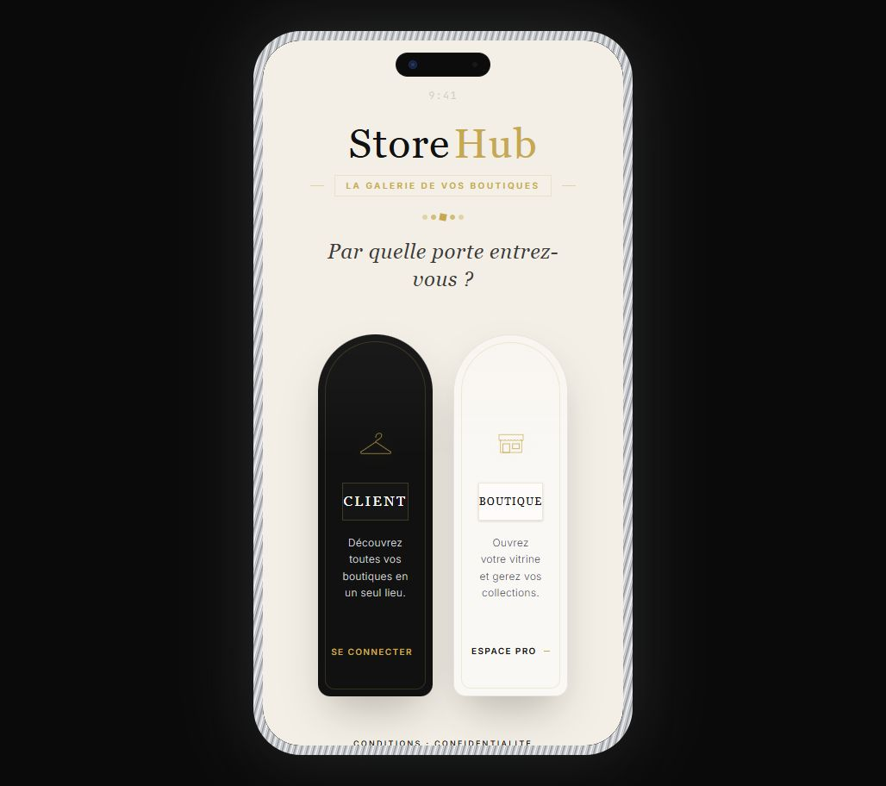
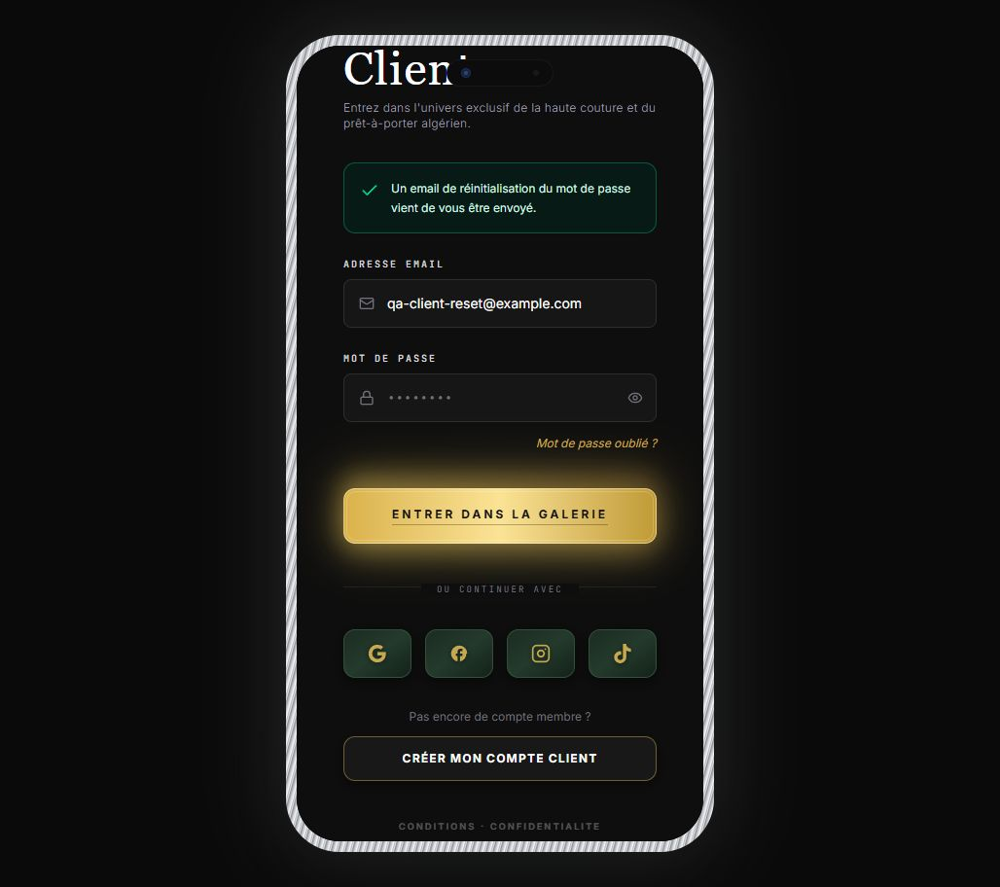
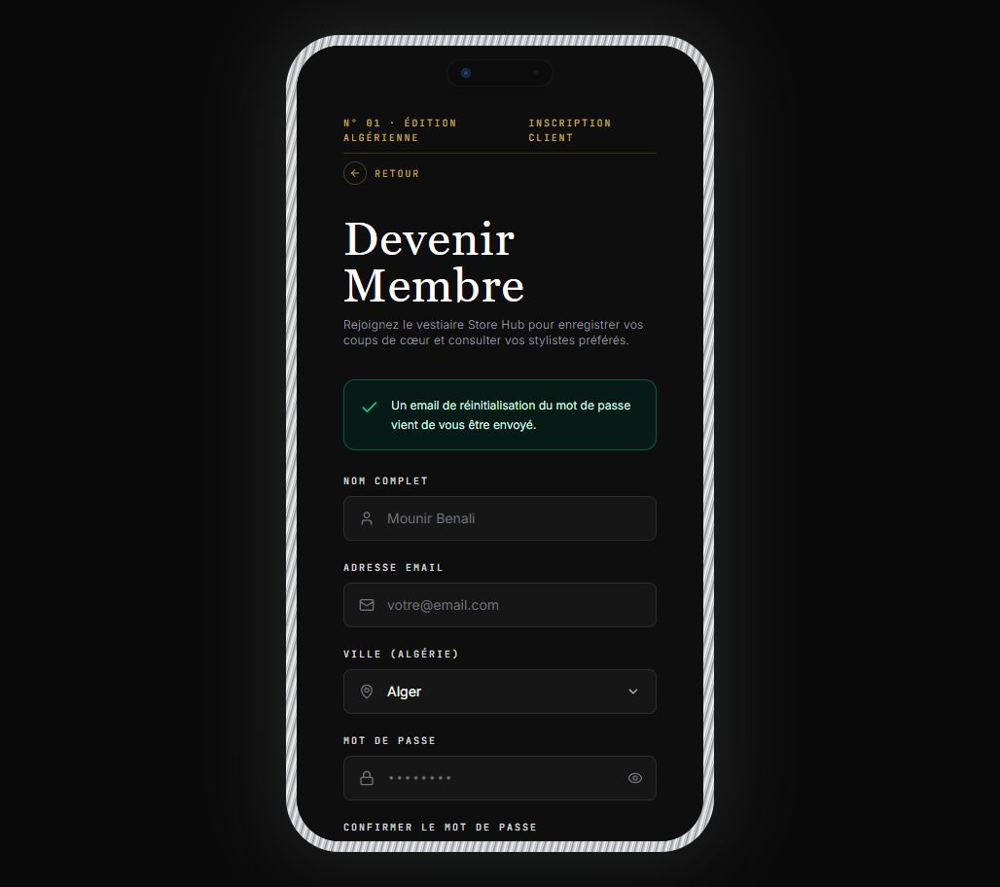
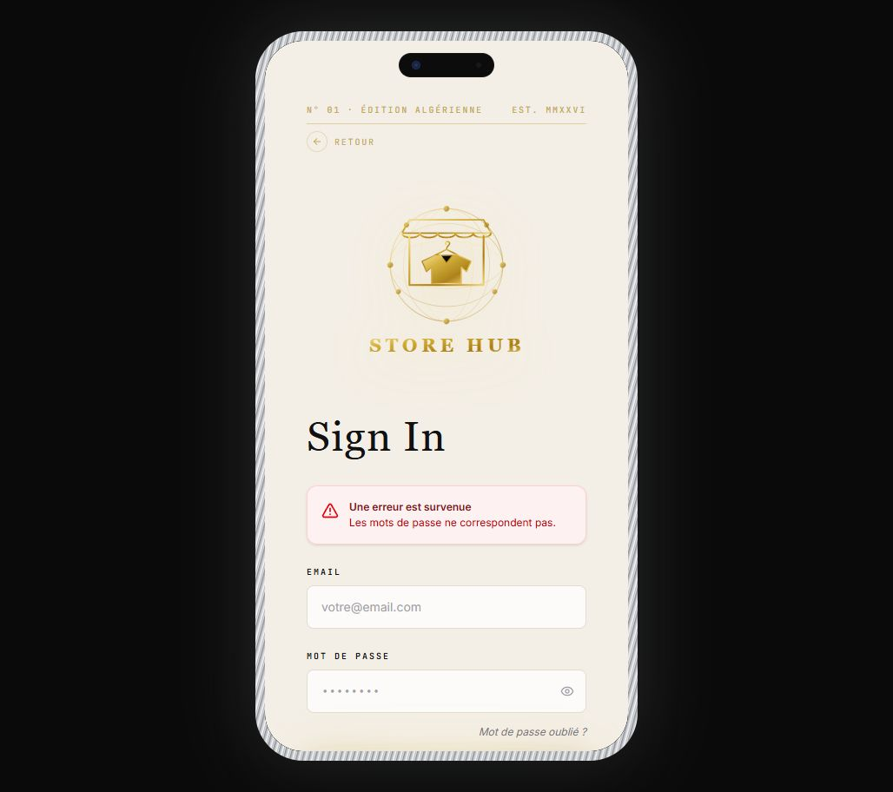
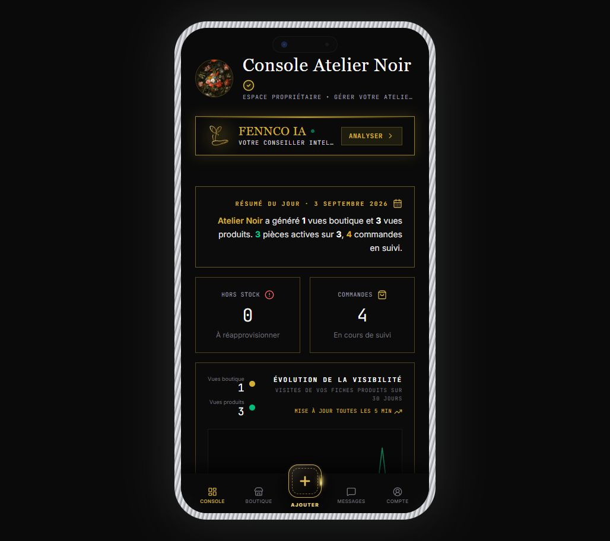
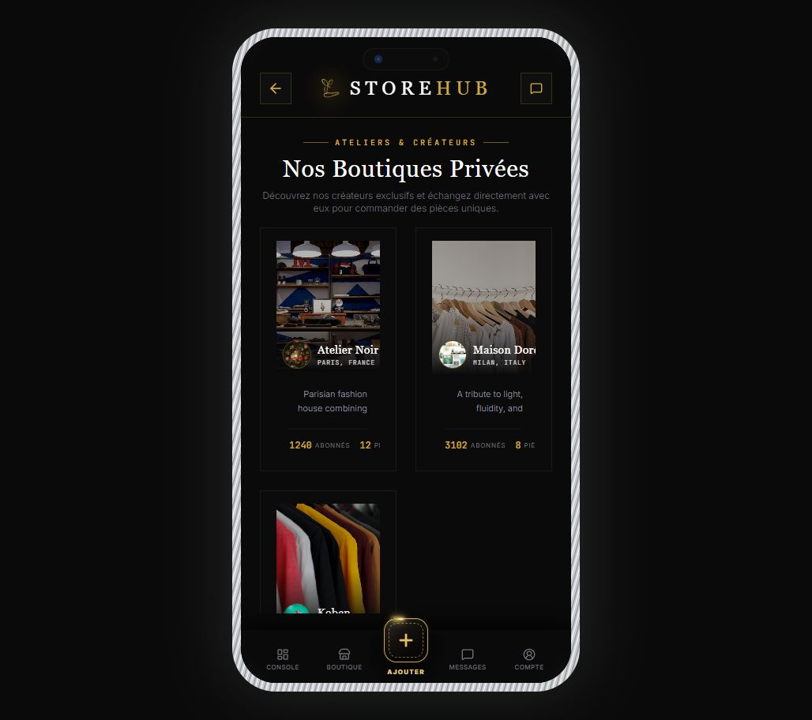
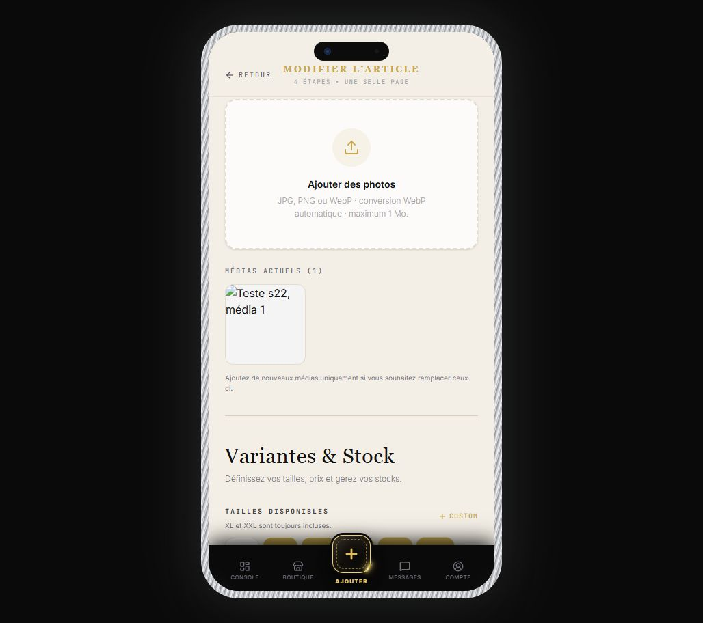
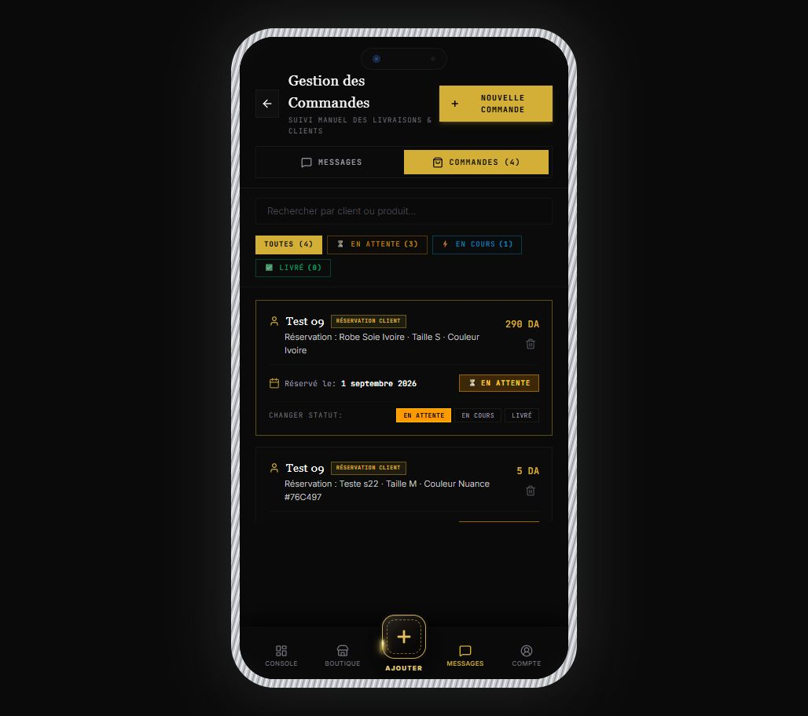
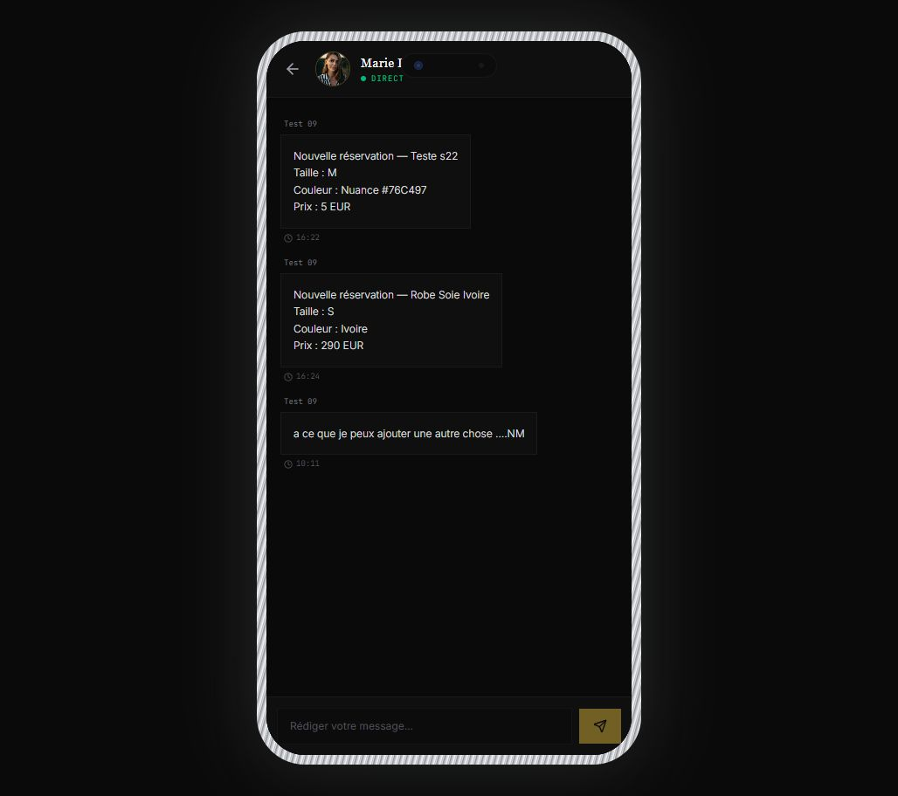
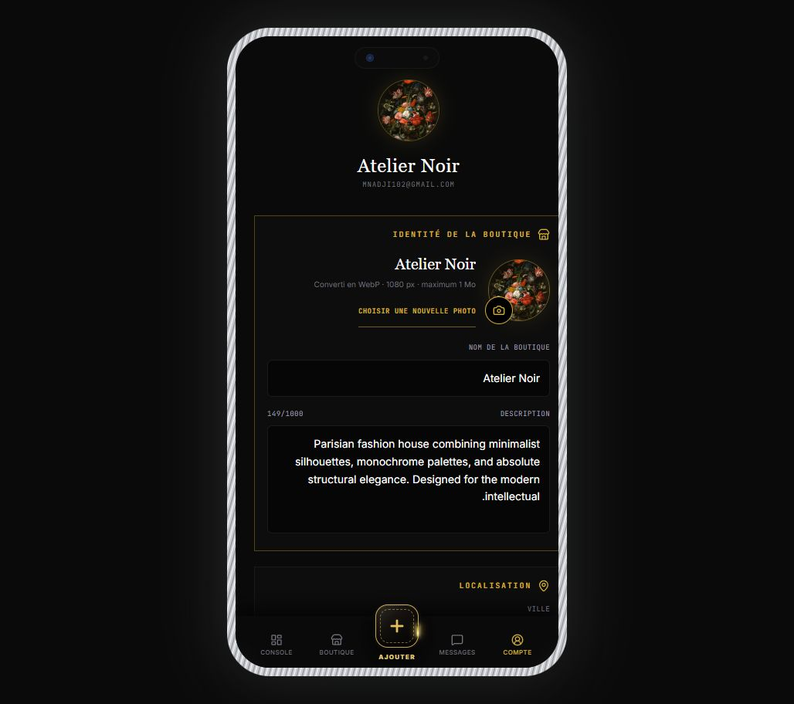

# Rapport de vérification — StoreHub Client & Boutique

Date : 3 septembre 2026  
Application testée : `http://localhost:3000/`  
Périmètre : parcours Client, parcours Boutique, API, Firebase, sécurité, données, commandes, messagerie, catalogue et statistiques.

## Verdict

**NON : tout ne fonctionne pas encore comme demandé et l’application ne doit pas être publiée en l’état.**

Les écrans principaux s’ouvrent, la compilation réussit et plusieurs appels Firebase/API fonctionnent. Toutefois, l’audit a confirmé des problèmes critiques d’authentification, de séparation Client/Boutique et de sécurité administrateur. La gestion automatique du stock à la livraison n’est pas programmée.

## Résumé des résultats

- **Fonctionnel ou largement fonctionnel :** sélection Client/Boutique, formulaires de connexion, validation d’inscription Client, réinitialisation de mot de passe, lecture du catalogue, pagination du catalogue Boutique, affichage des commandes, filtres de commandes, lecture de la messagerie, paramètres Boutique, aperçu public, ouverture de la modification d’un article, API publiques, protection 401 des API privées, compilation TypeScript et build de production.
- **Partiellement fonctionnel :** Google utilise le vrai mécanisme Firebase mais n’a pas été validé jusqu’au bout avec un compte de test propre; création de compte et réservation n’ont pas été exécutées afin de ne pas créer de vraies données; les règles Firebase présentes localement ne peuvent pas être confirmées comme déployées.
- **Défectueux ou dangereux :** déconnexion Firebase incomplète, mélange de rôles, boutons sociaux fictifs, boutique active codée en dur, accès administrateur avec identifiants dans le code, stock non décrémenté après livraison, données de démonstration utilisées comme secours, image produit enregistrée en URL temporaire, partage des favoris simulé, anciennes devises EUR dans la messagerie.

## Parcours vérifiés

### 1. Sélection du type de compte — ✅ Fonctionne visuellement

Les cartes Client et Boutique sont bien côte à côte sur le format téléphone. Elles sont toutefois construites comme des zones cliquables et non comme de vrais boutons accessibles au clavier.

### 2. Connexion et inscription Client — ⚠️ Partiel

- Le formulaire refuse correctement les champs manquants.
- La validation des mots de passe différents fonctionne.
- L’email de réinitialisation est bien demandé à Firebase.
- Le message de succès de réinitialisation reste affiché après passage à l’inscription : l’état de l’écran n’est pas nettoyé.
- Une inscription complète n’a pas été créée durant cet audit pour ne pas ajouter un faux utilisateur à Firebase.

### 3. Connexion Boutique — ⚠️ Partiel

Le formulaire utilise Firebase, mais une ancienne session Firebase reste active après la déconnexion visible de l’application. Un message d’erreur Client a également persisté jusque dans l’écran Boutique.

### 4. Connexions sociales — ❌ Critique

Les boutons Facebook, Instagram et TikTok ne lancent aucun fournisseur OAuth. Ils appellent directement la fonction interne de connexion avec des adresses fictives. Pendant le test, le bouton Facebook Boutique a ouvert le tableau de bord grâce à une ancienne session Firebase toujours présente.

### 5. Séparation Client/Boutique — ❌ Critique

Après une déconnexion puis une tentative de connexion Client par Facebook, l’application a affiché le contenu Client avec la barre de navigation Boutique. Le rôle demandé par l’écran est utilisé pour choisir la page, alors que le profil Firebase récupéré peut avoir un autre rôle.

### 6. Tableau de bord Boutique — ❌ Critique pour plusieurs vendeurs

Le tableau de bord charge toujours la boutique `boutique_1`. Il n’utilise pas la boutique réellement possédée par le compte connecté. Un deuxième vendeur pourrait donc voir les données publiques d’Atelier Noir et rencontrer des refus sur les données privées.

Les statistiques sont bien recalculées à partir des produits et commandes chargés, mais :

- « Clients » est calculé depuis le nom du client, pas son identifiant;
- « Catalogues » correspond en réalité au nombre de catégories;
- « Produits les plus vendus » utilise correctement les commandes marquées livrées;
- les commandes sont actualisées toutes les 10 secondes et le tableau principal toutes les 5 minutes.

### 7. Catalogue et modification produit — ⚠️ Partiel

- Recherche, filtres et pagination par 6 articles sont présents.
- Le bouton Modifier ouvre bien le formulaire de création/modification.
- Le produit « Teste s22 » contient une adresse d’image temporaire `blob:` liée à un ancien téléphone. L’image est donc cassée.
- Les tailles XL et XXL sont présentes dans les données renvoyées actuellement.
- La logique chaussures 16 à 49 et la configuration min/max existent dans le code, mais aucun produit chaussure réel n’était disponible pour un test complet à l’écran.

### 8. Commandes Boutique — ⚠️ Partiel

- Le bouton Commandes ouvre la bonne page.
- Quatre commandes sont chargées et les filtres sont visibles.
- Les changements de statut sont envoyés à l’API.
- **Le passage au statut Livré ne diminue pas le stock du produit.** L’API modifie uniquement le statut de la commande.
- En cas d’échec d’une action, plusieurs erreurs restent uniquement dans la console et ne sont pas affichées à l’utilisateur.

### 9. Messagerie — ⚠️ Partiel

- Deux conversations sont chargées et une conversation peut être ouverte.
- Les messages sont protégés par l’identité Firebase côté API.
- Les anciennes réservations affichent encore `EUR` dans le texte de message alors que l’application utilise maintenant le dinar algérien.
- L’envoi d’un message réel n’a pas été exécuté pendant l’audit afin de ne pas contacter un utilisateur existant.
- Le nom du contact est partiellement masqué par l’encoche du téléphone dans la conversation.

### 10. Compte Boutique et aperçu public — ✅ Affichage fonctionnel

Les champs de nom, photo, description, localisation et réseaux sociaux sont présents. L’aperçu public s’ouvre et le bouton de changement de couverture est visible. Aucune donnée réelle n’a été modifiée pendant l’audit.

## Vérifications techniques

| Contrôle | Résultat |
|---|---|
| API santé | ✅ Réponse 200 |
| Boutiques publiques | ✅ 3 boutiques renvoyées |
| Produits publics | ✅ 7 produits renvoyés |
| Devise produits | ✅ DZD pour les 7 produits |
| Historique visibilité | ✅ 30 jours renvoyés |
| API commandes sans connexion | ✅ Refus 401 |
| API réservations sans connexion | ✅ Refus 401 |
| API profil sans connexion | ✅ Refus 401 |
| API boutiques suivies sans connexion | ✅ Refus 401 |
| API messages sans connexion | ✅ Refus 401 |
| Vérification TypeScript | ✅ Réussie |
| Build de production | ✅ Réussi |
| Taille du paquet JavaScript principal | ⚠️ 1,70 Mo avant compression; avertissement Vite |
| Audit des dépendances de production | ❌ 7 vulnérabilités : 3 élevées, 4 modérées |
| Tests automatisés | ❌ Aucun test configuré |
| Déploiement des règles Firebase | ❓ Non vérifiable : CLI Firebase absente et `.firebaserc` absent |

## Liste des tâches à corriger

### P0 — Bloquants avant toute publication

- [ ] **Supprimer immédiatement les identifiants administrateur inscrits dans le code**, le bouton de remplissage automatique et toute connexion admin de secours. Faire vérifier le rôle `admin` exclusivement côté serveur/Firebase.
- [ ] **Corriger la session Firebase** : la déconnexion doit appeler `signOut`, vider l’état local puis attendre la confirmation Firebase. La restauration de session doit passer par `onAuthStateChanged`, jamais uniquement par `localStorage`.
- [ ] **Rendre le rôle Firebase autoritaire** : après connexion, diriger l’utilisateur selon le rôle enregistré et refuser toute différence entre le portail demandé et le profil réel.
- [ ] **Remplacer ou désactiver Facebook, Instagram et TikTok** tant que leur véritable authentification OAuth/Firebase n’est pas configurée. Aucun bouton ne doit connecter un utilisateur fictif.
- [ ] **Supprimer `ACTIVE_BOUTIQUE_ID = boutique_1`**. Toutes les données du tableau de bord, commandes, produits, statistiques et messages doivent être chargées depuis la boutique appartenant au compte Firebase connecté.
- [ ] **Supprimer le repli automatique vers Atelier Noir** dans la recherche de boutique propriétaire. Si le compte n’a pas de boutique, afficher un état « Créer/configurer ma boutique ».

### P1 — Risques élevés de données, commandes et sécurité

- [ ] **Décrémenter le stock lors du premier passage à Livré**, dans une transaction Firebase atomique et idempotente, avec contrôle du stock disponible. Ne jamais décrémenter deux fois la même commande.
- [ ] **Créer réservation + message de réservation de façon atomique**. Actuellement, le message est enregistré avant la commande; une panne intermédiaire crée des données incohérentes.
- [ ] **Retirer les données mockées des parcours de production**. Un catalogue vide ou une panne API doit afficher un vrai état vide/erreur, pas Atelier Noir ou des produits fictifs.
- [ ] **Réparer l’image du produit « Teste s22 »** et empêcher l’enregistrement futur d’URL `blob:`. Une image doit être compressée, envoyée dans Firebase Storage puis enregistrée avec son URL permanente.
- [ ] **Sécuriser les compteurs de vues** côté serveur ou Cloud Function. Les règles actuelles autorisent des mises à jour publiques insuffisamment contrôlées sur l’historique quotidien.
- [ ] **Déployer et vérifier réellement les règles Firestore/Storage** dans le bon projet Firebase. Ajouter `.firebaserc`, Firebase CLI et un test d’émulateur des permissions Client/Boutique/Admin.
- [ ] **Mettre à jour les dépendances vulnérables** (`express/qs/body-parser`, `browserslist`, `nanoid`, `postcss`, `protobufjs`) puis relancer build et audit.
- [ ] **Ajouter des tests automatisés et une intégration continue** pour connexion, déconnexion, rôles, propriétaire de boutique, réservation, stock, commandes, messages et règles Firebase.

### P2 — Fonctionnement et qualité à compléter

- [ ] Nettoyer les messages d’erreur/succès lors de chaque changement d’écran d’authentification.
- [ ] Afficher une erreur visible avec bouton Réessayer pour les échecs de changement de statut, disponibilité, suppression, envoi de message et chargement API.
- [ ] Calculer le nombre de clients avec `clientId`/email, pas avec le nom affiché.
- [ ] Renommer « Catalogues » en « Catégories » ou charger une vraie collection de catalogues Firebase.
- [ ] Migrer les anciens textes de réservation `EUR` vers `DA`, ou afficher la devise depuis les données structurées plutôt que depuis un texte enregistré.
- [ ] Enregistrer les favoris dans le compte Firebase et rendre le lien partagé réellement lisible. Le paramètre `?wishlist=` est actuellement créé mais jamais interprété.
- [ ] Remplacer le résultat simulé de recherche visuelle par une erreur honnête ou un vrai service d’analyse. Une panne ne doit pas générer de faux résultats.
- [ ] Restreindre Firebase Storage à JPEG, PNG et WebP; `image/.*` autorise aussi des formats comme SVG.
- [ ] Corriger l’accessibilité : cartes de rôle en vrais boutons, labels associés aux champs, navigation clavier, annonces d’erreur et focus visible.
- [ ] Corriger les zones sûres autour de l’encoche et remettre le défilement en haut à chaque changement de page.
- [ ] Découper le JavaScript en plusieurs paquets chargés à la demande pour réduire le temps de démarrage mobile.

## Limites de cet audit

Les actions qui auraient modifié des données réelles n’ont pas été exécutées : création d’un nouveau compte, réservation réelle, envoi d’un message, changement de statut, suppression de produit et téléversement d’image. La connexion Google n’a pas été terminée avec un compte de test dédié. Ces scénarios devront être couverts dans un environnement Firebase de test après correction des problèmes P0.

## Ordre recommandé

1. Sécuriser l’administrateur, la déconnexion et les rôles.
2. Isoler la boutique du vendeur connecté.
3. Corriger OAuth social, stock et réservation atomique.
4. Déployer/tester les règles Firebase.
5. Retirer les données simulées et réparer les images.
6. Mettre à jour les dépendances et ajouter les tests automatisés.
7. Finaliser les corrections UX et les performances.
